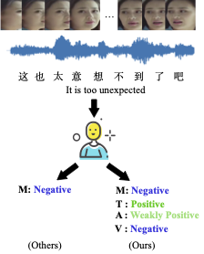

# MMSA 
> Pytorch implementation for codes in CH-SIMS: A Chinese Multimodal Sentiment Analysis Dataset with Fine-grained Annotations of Modality (ACL2020)

### Paper
---
[CH-SIMS: A Chinese Multimodal Sentiment Analysis Dataset with Fine-grained Annotations of Modality](https://www.aclweb.org/anthology/2020.acl-main.343/)

Please cite our paper if you find our work useful for your research:
```
@inproceedings{yu2020ch,
  title={CH-SIMS: A Chinese Multimodal Sentiment Analysis Dataset with Fine-grained Annotation of Modality},
  author={Yu, Wenmeng and Xu, Hua and Meng, Fanyang and Zhu, Yilin and Ma, Yixiao and Wu, Jiele and Zou, Jiyun and Yang, Kaicheng},
  booktitle={Proceedings of the 58th Annual Meeting of the Association for Computational Linguistics},
  pages={3718--3727},
  year={2020}
}
```

#### Dataset


- You can download CH-SIMS from the following links.
> md5: `6a92dccd83373b48ac83257bddab2538`

1. [Baidu Yun Disk](https://pan.baidu.com/s/1CmLdhYSVnNFAyA0DkR6tdA)[code: `ozo2`] 
2. [Google Drive]()[code: `****`]

### Support Models
In this framework, we support the following methods:

|     Type    |                    ModelName                   |                                          From                                          |
|:-----------:|:----------------------------------------------:|:--------------------------------------------------------------------------------------:|
| Single-Task |[EF_LSTM](models/singleTask/EF_LSTM.py)|[MultimodalDNN](https://github.com/rhoposit/MultimodalDNN)|
| Single-Task |[LF_DNN](models/singleTask/LF_DNN.py)|      -       |
| Single-Task |[TFN](models/singleTask/TFN.py)|[TensorFusionNetwork](https://github.com/A2Zadeh/TensorFusionNetwork)|
| Single-Task |[LMF](models/singleTask/LMF.py)| [Low-rank-Multimodal-Fusion](https://github.com/Justin1904/Low-rank-Multimodal-Fusion)|
| Single-Task |[MFN](models/singleTask/MFN.py)|[Memory-Fusion-Network](https://github.com/pliang279/MFN)|
| Single-Task |[MulT](models/singleTask/MulT.py)(without CTC) |[Multimodal-Transformer](https://github.com/yaohungt/Multimodal-Transformer)|
| Multi-Task  |[MLF_DNN](models/multiTask/MLF_DNN.py)|      -  |
| Multi-Task  |[MTFN](models/multiTask/MTFN.py)      |      -  |
| Multi-Task  |[MLMF](models/multiTask/MLMF.py)      |      -  |

### Usage
---

#### Run the Code
- Clone this repo and install requirements.
```
git clone https://github.com/thuiar/MMSA  
cd MMSA
pip install -r requirements.txt
```

#### Data Preprocessing
> If you want to extract features from raw videos, you can use the following steps. Or you can directly use the feature data provided by us.

- **fetch audios and aligned faces (see `data/DataPre.py`)**
1. Install [ffmpeg toolkits](https://www.ffmpegtoolkit.com/)
```
sudo apt update
sudo apt install ffmpeg
```

2. Run `data/DataPre.py`
```
python data/DataPre.py --data_dir [path_to_CH-SIMS]
```

- **get features (see `data/getFeature.py`)**
1. Download [Bert-Base, Chinese](https://storage.googleapis.com/bert_models/2018_11_03/chinese_L-12_H-768_A-12.zip) from [Google-Bert](https://github.com/google-research/bert).  
2. Convert Tensorflow into pytorch using [transformers-cli](https://huggingface.co/transformers/converting_tensorflow_models.html)  
3. Install [Openface Toolkits](https://github.com/TadasBaltrusaitis/OpenFace/wiki)  
4. Run `data/getFeature.py`
```
python data/getFeature.py --data_dir [path_to_CH-SIMS] --openface2Path [path_to_FeatureExtraction] -- pretrainedBertPath [path_to_pretrained_bert_directory]
```
5. Then, you can see the preprocessed features in the `path/to/CH-SIMS/Processed/features/data.npz`

#### Run models
> you can set parameters in `config_run.py`. And then run `run.py`

```
python run.py --modelName *** --datasetName sims --tasks MTAV
```